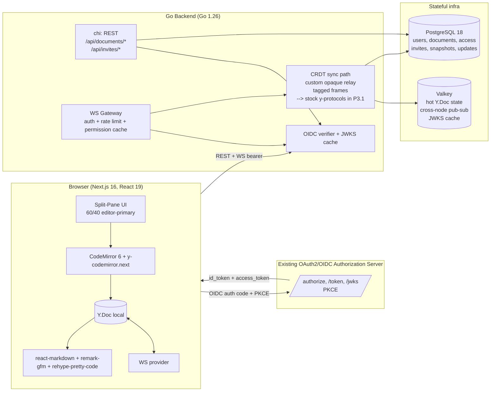

<!-- /autoplan restore point: /Users/abhishek/.gstack/projects/sync-scribe/plan-initial-blueprint-autoplan-restore-20260529-142442.md -->
<!-- v0 → v1 rewrite informed by /autoplan dual-voice review on 2026-05-29 -->
<!-- v2 → v3 rewrite informed by /office-hours session on 2026-05-30 -->

# SyncScribe — Project Blueprint v3

**Author:** Abhishek (lead architect)
**Status:** v3 — agent direction retired; positioned as a self-hosted OSS collaborative Markdown editor with first-class history, per-user provenance, and Yjs interop.
**Wedge:** Per-character, per-user provenance with a queryable API surface, on top of a stock-y-protocols-compatible Yjs server with a 60-second self-host story.

> **What changed from v0 (rough draft):** real-world Yjs Go server reference (`k_yrs_go`) replaces speculative `y-go`; IAM clarified as standard OIDC; persistence merged into M3 (no more "killed-server-loses-data" gap); state machine for connection UX; `document_invites` table; share-by-OIDC-magic-link flow; per-doc seq counter; `users.id TEXT`; `/metrics` from day one; rate limiting; full Markdown shortcut set + Yjs UndoManager; dark mode in Phase 1; cut chromedp PDF (use `@media print`); history slider re-defined to branch-not-overwrite.
>
> **What changed from v1 → v2:** scaffold and M0-M9 milestones removed from the active checklist; the M-numbered roadmap replaced by Phase 1 / Phase 2 sections framed around remaining ship blockers; CRDT-server question reopened as P1.1 because the live implementation is a custom Go opaque relay rather than stock `y-protocols`; explicit Phase 1 scope boundary added.
>
> **What changed from v2 → v3:** the AI-agent co-editing wedge has been retired. §4 (agent co-editing) is removed; premise #7 (agents as first-class users) is dropped; the §2 architecture diagram drops the agent client subgraph; agent-related risks in §9 are removed; P2.5 (agent platform depth) is removed. A new Phase 3 is added covering (a) agent-code retirement migration + cleanup, (b) stock y-protocols interop migration (formerly P2.8, now P3.1 with a sharpened rationale), (c) per-user provenance API surface (revert-preview, SSE event stream, attribution-aware export), and (d) a reproducible multi-user collaboration demo. P2.5 (agent platform depth) is removed entirely. Existing agent code (`apps/agents-demo/`, schema columns `users.actor`, `documents.agents_paused`, `document_updates.origin_actor`, `document_updates.agent_intent`, and related UI affordances) remains in the repo as of this revision and is scheduled for removal in P3.0. The full Phase 3 design lives in the office-hours design doc at `~/.gstack/projects/sync-scribe/abhishek-plan-initial-blueprint-design-20260530-190001.md`.

---

## 0. Tech stack (pinned to 2026 latest)

| Layer | Choice | Version |
|---|---|---|
| Frontend framework | Next.js (App Router) + React + TypeScript | Next 16, React 19, TS 5.7+ |
| Editor core | CodeMirror 6 + `y-codemirror.next` | latest |
| Markdown render | `react-markdown` + `remark-gfm` + `rehype-pretty-code` (Shiki) | latest |
| UI | Tailwind CSS + Shadcn UI + `react-resizable-panels` | Tailwind 4, Shadcn current |
| CRDT (client) | Yjs + custom WS provider matching the server's tagged-frame protocol | Yjs latest |
| Backend | Go (chi router, Gorilla WebSocket) | Go 1.26 |
| **CRDT server** | Custom Go opaque-relay WS + Postgres `document_updates` append log. Locked as the Phase 1 contract (see P1.1). | Phase 1 |
| Hot state / pub-sub | Valkey (Redis-compatible) | latest |
| Durable store | PostgreSQL | 18 |
| IAM | OIDC client against user's existing OAuth2/OIDC authorization server (PKCE supported) | — |
| Observability | Prometheus `/metrics`, structured logs (zerolog) | — |

**No `y-go`.** Original plan referenced an unverified library. The current implementation uses a custom Go relay; P1.1 has been resolved by taking Option A — keep the custom protocol for Phase 1. The stock `y-protocols` migration (formerly deferred as a Phase 2 load-driven optimization) is now Phase 3 P3.1 with a sharpened rationale: it is a prerequisite for OSS interop (third-party Yjs clients connecting to a SyncScribe server), not a load-driven optimization. The `k_yrs_go` persistence-sidecar question — REST-based persistence with a Rust+Go build and an FFI submodule — is a separate downstream consideration revisited only if compaction load motivates it.

---

## 1. Premises (numbered for explicit challenge)

1. **Yjs is the right CRDT** — best-in-class plain-text + awareness, CodeMirror 6 binding is canonical.
2. **Phase 1 sync = custom Go opaque relay over tagged frames** — Yjs update blobs are relayed opaquely between clients and appended to Postgres `document_updates`. P1.1 resolved Option A; the stock `y-protocols` migration is now Phase 3 P3.1, motivated by OSS interop rather than load.
3. **WebSockets only** for Phase 1 — server-authoritative simplifies permissions and audit.
4. **Standard OIDC** against existing authorization server — no IAM forks, supports PKCE for SPA.
5. **PostgreSQL + Valkey only** for persistence — no S3/blob store Phase 1.
6. **Markdown render is client-side** — server never renders.
7. **Per-character per-user provenance is the differentiator.** `document_updates(origin_user, created_at, seq)` is already the substrate; the moat is the API surface on top (revert-preview, SSE event stream, attribution-aware export) — see Phase 3.

---

## 2. System Architecture



---

## 3. CRDT & State Management

### 3.1 Client → Server
Client opens `wss://api/sync/{docId}` with `Authorization: Bearer <access_token>` (Sec-WebSocket-Protocol header for browser compat). The Go WS gateway:
1. Validates token against cached JWKS.
2. Looks up `(user, doc, role)` and caches write permission on the connection.
3. Relays opaque Yjs update bytes over the custom tagged WS protocol, with server `TagAck` after durable append. This is the locked Phase 1 contract — see §5.2 for the frame table and §8 P1.1 for the lock-in rationale.

### 3.2 Server-side document lifecycle
Current implementation:
- In-process `docSession` per active document.
- Update fan-out to connected peers, excluding the origin.
- Persistence: append incoming Yjs update batches to Postgres `document_updates`; snapshots are explicit user-published Markdown versions.
- Awareness is relayed and never persisted.
- Multi-node hot state/pub-sub is a Phase 2 concern (see §8 P2.6).

### 3.3 Persistence guarantees
- Client updates are debounced into Yjs update batches.
- Server appends each accepted batch to Postgres, then sends ACK to the origin; the UI may show `Saved` only after the ACK drains pending local batches.
- On document reopen: replay persisted update batches to the client, then emit sync-complete.
- Snapshot/update compaction and retention are Phase 2 (P2.6). At current scale `document_updates` rows per doc stay bounded; revisit once load metrics motivate compaction.

### 3.4 Concurrency hardening
- Current hub creation is mutex-guarded per process.
- Per-client send channel is size-bounded at 256 frames; overflow closes the socket today.
- Incoming binary frames are capped at 1 MiB.
- P1.4 adds the missing `RESYNC`/close contract and clarifies multi-node behavior.

### 3.5 Backpressure & rate limits
- Implemented: bounded outbound buffers and 1 MiB read limit.
- Remaining for Phase 1: per-connection WS update/byte buckets, per-IP connect caps, and per-user concurrent connection caps.

---

## 4. Per-User Provenance (the wedge)

### 4.1 Substrate (shipped)
- Yjs records `origin` per delta. Server-side we tag each update batch with the authenticated user and persist alongside `document_updates(origin_user, seq, created_at)`.
- This gives per-character, per-user blame for free at the persistence layer. The substrate has been live since Phase 1.

### 4.2 Surface (Phase 3)
The moat is the API surface on top of the substrate, not the substrate itself:
- `GET /api/docs/:id/attribution?fromItem=&toItem=&sinceUpdateId=` — query who wrote which range.
- `POST /api/docs/:id/revert/by-user/:userId/preview?since=` — dry-run preview of reverting one user's contributions in a time window, with explicit revertable/orphaned partitioning.
- `GET /api/docs/:id/events` (SSE) — provenance event stream for external tooling.
- `GET /api/docs/:id/export?format=md&attribution=footnotes` — Markdown export with attributed footnotes.

Full spec lives in the office-hours design doc; the milestone breakdown is P3.1–P3.4 below.

### 4.3 Position vocabulary
All provenance surfaces use Yjs item-id ranges as the canonical anchor, with UTF-16 code-unit offsets as a derived convenience field. No byte offsets anywhere — Markdown contains multibyte content and stable anchors must survive concurrent edits.

---

## 5. API Design

### 5.1 REST (chi router, JSON, bearer auth, all under `/api`)

| Method | Path | Purpose |
|---|---|---|
| `GET` | `/me` | Current user from token |
| `GET` | `/documents` | List docs user owns or has access to |
| `POST` | `/documents` | Create `{ title }` → doc metadata |
| `GET` | `/documents/:id` | Metadata + current snapshot pointer |
| `PATCH` | `/documents/:id` | Rename, change `link_default_role` |
| `DELETE` | `/documents/:id` | Soft delete (owner only) — cascades via app logic, not FK |
| `GET` | `/documents/:id/snapshots` | List versions |
| `GET` | `/documents/:id/snapshots/:version` | Fetch snapshot blob |
| `POST` | `/documents/:id/access` | `{ user_id, role }` — known users only |
| `DELETE` | `/documents/:id/access/:user_id` | Revoke |
| `POST` | `/documents/:id/invites` | `{ email, role }` — magic-link for unknown email |
| `POST` | `/invites/:token/claim` | Called after OIDC login; materializes `document_access` row |
| `GET` | `/documents/:id/share-links` | List owner-managed public links |
| `POST` | `/documents/:id/share-links` | Create owner-managed public link |
| `DELETE` | `/documents/:id/share-links/:token` | Revoke public link |
| `GET` | `/share/:token` | Public share-link metadata |
| `GET` | `/documents/:id/export?format=md` | Markdown export |
| `GET` | `/metrics` | Prometheus metrics |

### 5.2 WebSocket `/api/sync/:docId`

**Wire format (current, P3.1/P3.3):** stock `y-protocols` varint framing — `[msgType: varint] [body...]` — carrying opaque Yjs update bytes. The server never interprets Yjs payloads. Subprotocol is `syncscribe.yjs.v1`; a client that doesn't negotiate it is refused with close code 4002. The historical Phase 1 tagged transport (`syncscribe.v1`, 1-byte tags `0x00`–`0x05`) was removed once both first-party clients spoke y-protocols. SDK lives in `packages/client`; `apps/web/app/lib/yjs.ts` is a thin adapter over it.

| msgType | Meaning |
|---|---|
| `0` MsgSync | Sync sub-protocol: SyncStep1 (0), SyncStep2 (1, validated+discarded server-side), SyncUpdate (2) |
| `1` MsgAwareness | y-protocols awareness; guests anonymized server-side |
| `4` MsgReadonly | server rejected writes for this conn (SyncScribe extension) |
| `5` MsgAck | one per durable append, drives Saving/Saved (SyncScribe extension) |

On connect the server replays stored updates as SyncUpdate frames, then its own SyncStep1, then MsgReadonly if applicable — a client that sees the server's SyncStep1 is caught up. A `RESYNC` close (code 4010) is reserved for buffer-overflow recovery; see §8 P1.4 for the contract.

**Handshake:**
1. Authenticated clients connect with bearer as the second `Sec-WebSocket-Protocol` entry after `syncscribe.yjs.v1`.
2. Public share-link clients connect with `?share_token=...`.
3. Server validates BEFORE accepting upgrade. Reject = HTTP 401/403. No mid-stream AUTH frame race.
4. Awareness frames are relayed; guest awareness is anonymized server-side.

---

## 6. Database Schema (PostgreSQL 18)

> **v3 cleanup note:** the columns `users.actor`, `documents.agents_paused`, `document_updates.origin_actor`, and `document_updates.agent_intent` are legacy from the retired agent direction. They remain in the live schema as of this revision; P3.0 ships a migration that drops them along with the related `idx_users_actor` index. The schema block below shows the **post-P3.0 target state**, not the current live shape.

```sql
CREATE EXTENSION IF NOT EXISTS citext;

-- OIDC sub is free-form string, not UUID. Use it as PK.
CREATE TABLE users (
  id            TEXT PRIMARY KEY,            -- OIDC sub
  email         CITEXT UNIQUE NOT NULL,
  display_name  TEXT NOT NULL,
  avatar_url    TEXT,
  created_at    TIMESTAMPTZ NOT NULL DEFAULT now(),
  last_seen_at  TIMESTAMPTZ
);

CREATE TABLE documents (
  id                   UUID PRIMARY KEY DEFAULT gen_random_uuid(),
  owner_id             TEXT NOT NULL REFERENCES users(id) ON DELETE RESTRICT,
  title                TEXT NOT NULL DEFAULT 'Untitled',
  current_version      BIGINT NOT NULL DEFAULT 0,
  link_default_role    TEXT NOT NULL DEFAULT 'private'
                       CHECK (link_default_role IN ('private','link_view','link_edit')),
  deleted_at           TIMESTAMPTZ,
  created_at           TIMESTAMPTZ NOT NULL DEFAULT now(),
  updated_at           TIMESTAMPTZ NOT NULL DEFAULT now()
);
CREATE INDEX idx_documents_owner ON documents(owner_id) WHERE deleted_at IS NULL;

CREATE TABLE document_access (
  document_id  UUID NOT NULL REFERENCES documents(id) ON DELETE CASCADE,
  user_id      TEXT NOT NULL REFERENCES users(id) ON DELETE CASCADE,
  role         TEXT NOT NULL CHECK (role IN ('viewer','editor','owner')),
  granted_by   TEXT NOT NULL REFERENCES users(id),
  granted_at   TIMESTAMPTZ NOT NULL DEFAULT now(),
  PRIMARY KEY (document_id, user_id)
);
CREATE INDEX idx_access_user ON document_access(user_id);

-- New: unblocks share-by-email when recipient has no account yet.
CREATE TABLE document_invites (
  token        TEXT PRIMARY KEY,            -- url-safe random
  document_id  UUID NOT NULL REFERENCES documents(id) ON DELETE CASCADE,
  email        CITEXT NOT NULL,
  role         TEXT NOT NULL CHECK (role IN ('viewer','editor')),
  invited_by   TEXT NOT NULL REFERENCES users(id),
  expires_at   TIMESTAMPTZ NOT NULL DEFAULT (now() + interval '14 days'),
  claimed_at   TIMESTAMPTZ,
  revoked_at   TIMESTAMPTZ,
  created_at   TIMESTAMPTZ NOT NULL DEFAULT now()
);
CREATE INDEX idx_invites_email ON document_invites(email) WHERE claimed_at IS NULL AND revoked_at IS NULL;

CREATE TABLE document_snapshots (
  document_id   UUID NOT NULL REFERENCES documents(id) ON DELETE CASCADE,
  version       BIGINT NOT NULL,
  state_vector  BYTEA NOT NULL,
  doc_blob      BYTEA NOT NULL,
  last_seq      BIGINT NOT NULL,             -- highest update.seq folded into this snapshot
  size_bytes    INT GENERATED ALWAYS AS (octet_length(doc_blob)) STORED,
  created_by    TEXT REFERENCES users(id),
  created_at    TIMESTAMPTZ NOT NULL DEFAULT now(),
  PRIMARY KEY (document_id, version)
);
CREATE INDEX idx_snapshots_doc_time ON document_snapshots(document_id, created_at DESC);

-- Per-doc seq. No global BIGSERIAL hot-spot.
CREATE TABLE document_updates (
  document_id   UUID NOT NULL REFERENCES documents(id) ON DELETE CASCADE,
  seq           BIGINT NOT NULL,
  update_blob   BYTEA NOT NULL,
  origin_user   TEXT REFERENCES users(id),
  created_at    TIMESTAMPTZ NOT NULL DEFAULT now(),
  PRIMARY KEY (document_id, seq)
);
CREATE INDEX idx_updates_doc_seq ON document_updates(document_id, seq);
-- P3.2 adds: CREATE INDEX idx_updates_doc_user_time ON document_updates(document_id, origin_user, created_at);

-- Public share links
CREATE TABLE document_share_links (
  id           UUID PRIMARY KEY DEFAULT gen_random_uuid(),
  document_id  UUID NOT NULL REFERENCES documents(id) ON DELETE CASCADE,
  token        TEXT UNIQUE NOT NULL,
  role         TEXT NOT NULL CHECK (role IN ('viewer','editor')),
  created_by   TEXT NOT NULL REFERENCES users(id),
  expires_at   TIMESTAMPTZ,
  revoked_at   TIMESTAMPTZ,
  created_at   TIMESTAMPTZ NOT NULL DEFAULT now()
);
```

Auth predicates (live in `internal/authz`, called on every REST route and cached at WS connect):
- `can_read(doc, user)` := owner OR access row OR valid share link
- `can_write(doc, user)` := owner OR access role in (`editor`,`owner`) OR `editor` share link

Soft-delete rule: app filters `deleted_at IS NULL` everywhere. A nightly job hard-deletes after 30 days and that's what triggers the CASCADE on `document_access`. **Bug from v0 fixed.**

---

## 7. Connection State Machine (UX contract)

Client renders one of these states; behavior contract is explicit so users never feel data loss.

```
connecting → syncing → live ⇄ offline
                         ↓
                      readonly
```

| State | Pill | Editing? | Behavior |
|---|---|---|---|
| connecting | spinner | local-only | typing buffered in Y.Doc; "connecting…" |
| syncing | amber dot | local-only | sync step 1/2 in flight; "loading other edits…" |
| live | green dot | full | normal |
| offline | amber | full (buffered) | reconnect with backoff; save status shows "Offline" |
| readonly | gray + lock | blocked | permission revoked mid-session or share-link viewer |

Save status is separate from connection state: `Saving`, `Saved`, or `Offline`, based on debounced local batches and server ACKs.

---

## 8. Active Implementation Plan

The original M0-M9 checklist has mostly landed: monorepo/tooling, OIDC login, dashboard, collaborative editor, custom WS sync, Postgres update persistence, invites, share links, snapshots/history modal, Markdown export, print stylesheet, public share page, typing indicators, save-status ACKs, and Mermaid dark-mode rendering are implemented. (The legacy agent-pause and agent-rate-limit UI shipped here too and are scheduled for removal in P3.0.) They are intentionally not repeated below.

### Phase 1 — Remaining Ship Blockers

Phase 1 now means "make the current product coherent, testable, and honest enough to ship." Do not add new product surface unless it closes one of these gaps.

#### Phase 1 Scoped Items
Phase 1 scope is intentionally narrow: collaborative Markdown editing, authenticated and public sharing, durable server-backed updates, and snapshots/export. These items are explicitly outside the Phase 1 scope boundary:

- Horizontal multi-node WS.
- Comments / suggestions / inline annotations.
- Mobile-first editing polish.
- Image / asset uploads.
- E2E encryption.
- Billing / product analytics.
- Rich PDF generation beyond browser print.

#### P1.1 — CRDT/protocol decision closure ✅ resolved (Option A)
- **Decision:** keep the custom Go opaque-relay + tagged-frame protocol as the Phase 1 wire contract. Stock `y-protocols` framing and the `k_yrs_go` persistence sidecar are deferred to Phase 2 (P2.x).
- **Rationale:** (a) `k_yrs_go` is REST-based persistence, not a WS/y-protocols sync server, so adopting it does not by itself replace the WS gateway; (b) it ships no Docker image or tagged releases and requires a Rust+Go build with an FFI submodule — operationally heavy relative to Phase 1's current scale; (c) the custom relay is already exercised by `apps/api/internal/sync/hub_test.go` and has shipped real edits.
- **Remaining acceptance:** add a JS↔JS convergence regression test exercising the locked path end-to-end, and ensure `packages/proto/src/index.ts` either drops the unused `y-protocols` constants or marks them as "reserved for P2 migration".

#### P1.2 — Persistence and recovery hardening ✅ resolved
- **Durable-save contract (shipped):** client increments `pendingSaves` on each WS write and decrements on `TagAck`; UI shows "Saved" only when the counter drains, the debounced/outbox buffers are empty, and the connection is `live`. On reconnect the counter is recomputed from `outbox.length` so in-flight ACKs lost to the drop don't leave the UI stuck on "Saved".
- **Server-side guarantee (shipped):** `docSession.loop` calls `AppendUpdate` first and only emits `TagAck` + broadcast on success — a failed append produces no ACK and no fan-out, so the client's `pendingSaves` stays non-zero and the UI keeps reading "Saving…".
- **Tests added (shipped):** `apps/api/internal/sync/persistence_test.go` covers (a) no-ACK on persist failure, (b) replay order: updates → `TagSyncComplete` → optional `TagReadonly`, (c) reconnect replay containing every persisted update, (d) "server restart" via fresh `Hub` over the same store replays identical bytes, (e) readonly viewer cannot append. Total Phase 1 sync tests now 17.
- **Compaction/retention:** deferred to Phase 2 (P2.6) — current scale doesn't motivate it.
- **Acceptance met:** "Saved" only appears after the server has persisted the last debounced batch, and replay after restart restores the latest persisted content.

#### P1.3 — Agent wedge completion (shipped under v2; direction retired in v3)
This milestone shipped under the v2 agent-wedge framing. It is retained here as a historical record of what's currently in the codebase. P3.0 removes the artifacts produced by this milestone (`apps/agents-demo/`, agent-specific schema columns, UI affordances).

- **Stubs removed:** the `POST /agent-ops/replace-block` and `/agent-ops/append-section` 501 handlers were removed during v2.
- **Reference client shipped:** `apps/agents-demo/` is a Node + TypeScript client that exercises the OIDC `client_credentials` → WS-bearer → Y.Doc edit → ACK round trip against the custom protocol. P3.0 removes this app.
- **Attribution metadata** is persisted in `document_updates(origin_user, origin_actor, agent_intent)`. The user-facing hover/blame overlay was deferred. In v3 the per-user attribution is repositioned as the wedge and surfaces in P3.2; `origin_actor` and `agent_intent` are removed in P3.0.

#### P1.4 — Realtime safety and limits
- **Per-connection rate limits (shipped):** token-bucket on frames (`defaultUpdatesPerSec=60`, burst 120) and bytes (1 MiB/sec sustained, 4 MiB burst) in `apps/api/internal/sync/limits.go`. Exhaustion closes the conn with `closeRateLimited` (4008) instead of silently dropping.
- **Per-IP concurrent connection cap (shipped):** `ipRegistry` enforces `defaultConnsPerIP=32` slots, checked *before* OIDC verification so unauth floods are cheap to reject. `X-Forwarded-For` trusted only when `RemoteAddr` is loopback. Metric: `syncscribe_sync_ip_cap_rejects_total`.
- **RESYNC contract (shipped):** outbound buffer overflow now writes close code 4010 (`closeResync`) before tearing the socket. Web provider listens for 4010, drops local Y.Doc state, and reconnects with a fresh sync round.
- **Permission revocation (already in place):** `Hub.SetWriteAccess` flips `conn.canWrite` atomically; `readPump` checks per-frame so revoked writers go readonly without reload. (`SetAgentsPaused` shipped here too; removed in P3.0.)
- **Per-user concurrent caps:** deferred; the IP cap already bounds the simple-flood case.
- **Multi-node note:** all of the above is in-process only. Multi-node enforcement (cross-node IP cap, cross-node revocation broadcast) is part of P2.6.

#### P1.5 — Ship gate QA
- Add focused E2E/browser smoke tests for:
  - create document → edit → Saved → refresh/replay;
  - two tabs collaborate;
  - invite claim;
  - public viewer/editor share link;
  - print output excludes app chrome;
  - dark-mode Mermaid connector visibility.
- Run CI plus local `go test ./...`, web typecheck/build/lint, and one manual print check in Chrome.
- Acceptance: no known P0/P1 bugs, README/PLAN match the product, and Phase 1 can be tagged.

### Phase 2 — Follow-On Product Plan

Phase 2 starts after the Phase 1 ship gate. It should improve depth and reliability rather than reopen foundational architecture unless P1.1 chose the standard-provider migration.

#### P2.1 — History and review UX
- First implementation pass shipped: history now has a scrubber/list layout, author metadata, per-version update ranges, contributor counts, and a current-editor diff view for text snapshots. (The author breakdown currently distinguishes humans/agents/guests; P3.0 collapses this to user/guest.)
- Completion pass shipped: P2.1 checklist is implemented against text snapshots.
- Upgrade the current snapshot modal into a real history scrubber.
- Show actor breakdown per version and, where possible, sub-snapshot update ranges.
- Add visual diff between current content and selected snapshot.
- Keep restore branch-like: restoring creates a new HEAD snapshot and never destroys history.

#### P2.2 — Export polish
- First implementation pass shipped: toolbar export now opens a modal that reports Markdown snapshot freshness, can publish current editor content before download, and gives PDF/print a first-class action with print-only title/footer metadata.
- Completion pass shipped: PDF printing hides app chrome, avoids modal/header overlap, wraps code blocks, and Markdown export freshness is explicit before download.
- Keep Markdown export backed by the latest snapshot, but surface freshness clearly if the editor has unsnapshotted changes.
- Add a first-class PDF/export flow around the existing print stylesheet: title metadata, page headers/footers, predictable code-block breaks, and browser validation.
- Add export tests for Markdown and print CSS regressions.

#### P2.3 — Collaboration UX
- First implementation pass shipped: the editor now has a collaborator presence dock for editors and guests with typing state, live counts, and brief disconnect linger. (The dock currently has agent affordances and an intent display; P3.0 removes those.)
- Completion pass shipped: backend-backed comments/suggestions with line anchors, resolve flow, local browser draft recovery for long disconnects, and mobile access through the actions menu.
- Comments, suggestions, and inline annotations.
- Better presence affordances: off-screen cursor indicators, stacked cursor labels, and cursor-name linger behavior.
- Offline/local recovery UX, likely IndexedDB-backed, for unsent changes after long disconnects.
- Mobile editing pass beyond the current responsive layout.

#### P2.4 — Sharing and governance
- First implementation pass shipped: owner share-link creation now defaults to expiring links, offers explicit expiration presets, warns on public editor links, shows active-link count, and exposes created/expires metadata next to revoke/copy controls.
- Completion pass shipped: server-side public guest awareness sanitization, owner activity log, invite cancel/resend controls, and activity events for access, snapshots, invites, links, and comments.
- Server-side awareness filtering for public guests so anonymity is enforced even if a modified client sends identifying fields.
- Share-link expiration/revocation UX improvements and access audit trail.
- Optional invite resend/cancel flows.
- Owner-facing activity log for joins, edits, publishes, restores, and access changes.

#### P2.5 — REMOVED in v3
Originally "Agent platform depth." Removed when the agent direction was retired. Its concerns (richer attribution overlay, activity timeline, design-partner feedback loop) re-emerge in Phase 3 reframed around per-user provenance rather than per-agent activity.

#### P2.6 — Scale and operations
- First implementation pass shipped: Valkey pub-sub broker for multi-node WS, hourly retention loop with `retention_runs` audit table, `/admin/stats` + `/admin/retention-runs` operator endpoints, Prometheus metrics on the sync hub, and k6 load scripts under `load-tests/k6/` for active-doc, reconnect-storm, and share-link scenarios.
- Completion pass shipped: `/health/canary` deep probe (DB + broker + retention freshness, 503 on degradation), importable Grafana dashboard JSON under `infra/grafana/`, and LB guidance under `infra/lb/` covering nginx consistent-hash, ALB stickiness, and HAProxy.
- Horizontal WS scale: sticky sessions or consistent-hash by `docId`, plus Valkey pub-sub if multiple API nodes are needed.
- Snapshot/update retention jobs and admin observability around document growth.
- Load tests for active documents, reconnect storms, and public share links.
- Canary/production health checks and dashboards.

#### P2.7 — Content capabilities
- First implementation pass shipped: `document_assets` migration + store/HTTP layer with 8 MiB-capped image uploads (png/jpeg/gif/webp/svg), CodeMirror paste+drop handler that uploads and splices the markdown reference at the cursor, bearer-aware `AuthedImg` renderer in the preview/PDF pipeline, dashboard "Import .md" button that seeds the new Yjs doc on first live sync, and print-CSS hardening that normalizes Mermaid SVG colors + bounds asset/diagram sizes to the page.
- Image/asset uploads and Markdown asset references.
- Optional diagram export hardening for Mermaid-heavy documents.
- Import flows for existing `.md` files.

#### P2.8 — REMOVED in v3 (folded into P3.1)
Originally "Persistence-server migration (deferred from P1.1)" — evaluate `k_yrs_go` as a persistence sidecar once load motivates compaction. The stock `y-protocols` interop migration that was bundled here is now P3.1 with a sharpened rationale (OSS interop, not load). The persistence-sidecar evaluation is deferred indefinitely; revisit only if compaction-driven latency is measurable.

### Phase 3 — Agent Retirement + Interop + Per-User Provenance

Phase 3 is the next-major-milestone authored by the office-hours session on 2026-05-30. Full design lives at `~/.gstack/projects/sync-scribe/abhishek-plan-initial-blueprint-design-20260530-190001.md`. This section is the committed checklist; the design doc carries the rationale.

#### P3.0 — Agent code retirement (precondition)
- Migration: drop `users.actor`, `idx_users_actor`, `documents.agents_paused`, `document_updates.origin_actor`, `document_updates.agent_intent`.
- Remove `apps/agents-demo/`.
- Remove agent-specific UI affordances in the presence dock and any "agents paused" banner.
- Strip agent-related text from README, CLAUDE.md routing, and any other docs.
- Update tests that reference agent code paths.
- Acceptance: full `go test ./...` and web typecheck/build/lint pass; grep for `agent`, `Agent`, `actor='agent'`, `origin_actor`, `agents_paused`, `agent_intent` returns zero hits outside this plan.md history sections and the design doc.

#### P3.1 — Stock y-protocols interop migration (B1 in design doc)
- ✅ Convert the WS sync path to stock `y-protocols` framing. (The dual-framing sniffer was skipped — both first-party clients already preferred `syncscribe.yjs.v1` and the SDK was unpublished, so the legacy transport was removed outright instead; see P3.3.)
- `@syncscribe/client` v0.1 SDK is now modular and `dist`-buildable with `publishConfig` set; the actual `npm publish` remains the open item.
- ✅ Add `GET /api/docs/:id/attribution` with `sinceUpdateId` cursor.
- ✅ `syncscribe-integration-example` demonstrates a non-Web client.
- Remaining: `docker compose up` quickstart polish, npm publish, tag **v0.1**.

#### P3.2 — Per-user provenance write surface (B2 in design doc)
- `POST /api/docs/:id/revert/by-user/:userId/preview` — dry-run preview with revertable/orphaned partitioning, transitively closed.
- `GET /api/docs/:id/events` SSE event stream with bounded ring buffer + `Last-Event-ID` resume.
- `GET /api/docs/:id/export?attribution=footnotes` — attribution-aware Markdown export.
- SDK v0.2: `onProvenance`, `revertPreview`, `exportWithProvenance`.
- Add migration: `CREATE INDEX idx_updates_doc_user_time ON document_updates(document_id, origin_user, created_at)`.
- Tag **v0.2**.
- Acceptance criteria in the design doc.

#### P3.3 — Reproducible collab demo + v0 framing removal (B3 in design doc)
- `tools/collab-demo/` runs a scripted three-user editing recipe; produces a deterministic transcript matching a checked-in golden file.
- ✅ **Legacy custom v0 framing removed** (pulled forward ahead of the demo). The server, SDK, and web all speak only `syncscribe.yjs.v1`; non-matching clients are refused with close code 4002. History now replays at connection-open rather than on the client's first SyncStep1. Approved breaking change. Note: the server validates-and-discards client SyncStep2 — a stock y-protocols client with pre-existing offline state loses it (first-party clients resend from their outbox); revisit when update compaction (P2.6) lands.
- Tag **v0.3**.
- Acceptance criteria in the design doc.

#### P3.4 — Follow-on (not gated on milestone): technical write-up
- 4-6k word post on the architecture + provenance API. Workshop or blog. Gated on P3.2 acceptance; do not block P3.3 on writing velocity.

---

## 9. Acknowledged risks

1. **CRDT server/protocol lock-in.** Phase 1 ships the custom opaque relay + tagged-frame contract. P3.1 migrates to stock `y-protocols` with a dual-framing sniffer; the rollback path is the previous image and clients see a `RESYNC` close on mid-flight rollback.
2. **Per-user provenance moat unproven.** Phase 1 ships the persistence substrate (`origin_user` per update); the surface (P3.2) is unproven externally. Mitigation: ship P3.1 first and use any external integrator feedback to inform P3.2 priorities.
3. **Snapshot blob growth.** Retention policy: keep last 100 snapshots per doc, GC nightly. Stays under 10 MB/doc median.
4. **IdP availability** — if your auth server is down, nobody can log in. Cache JWKS aggressively; allow already-issued access tokens to ride out 5-min outages.
5. **Revert-preview correctness under interleaved edits.** P3.2 ships dry-run only; the orphan partition is non-trivial to get right. Covered by an integration test with a hand-constructed interleaved-edits case checked against a golden file.

---

## Provenance

- **v0 → v1** lineage: see the `WIP: autoplan review report` commit (3fa5dbd) for the original draft, subagent findings, and decision audit trail. v1 absorbed 15 auto-decisions, 3 user-challenge resolutions (`k_yrs_go` replaces `y-go`, OIDC-against-existing-IdP replaces "Valkey IAM" framing, AI-agent co-editing wedge adopted), and 3 taste calls (60/40 split, curated 12-color palette, Hocuspocus as the documented fallback).
- **v1 → v2** lineage: this revision was produced after the implementation pass. M0-M9 work removed from the active checklist, the active plan reframed as Phase 1 / Phase 2 with explicit scope boundaries, and the CRDT/protocol question reopened as P1.1.
- **v2 → v3** lineage: this revision was produced by `/office-hours` on 2026-05-30 after the user retired the AI-agent direction. §4 rewritten to position per-user provenance as the wedge; §1 premise #7 dropped; §2 architecture diagram redrawn without the agent client subgraph; §6 schema rewritten to show the post-P3.0 target state with the legacy agent columns called out as scheduled for migration; §8 reorganized to remove P2.5 (agent platform depth), fold P2.8 into the new P3.1, and add a full Phase 3 covering agent retirement (P3.0), stock y-protocols interop migration (P3.1), per-user provenance write surface (P3.2), reproducible collab demo (P3.3), and a follow-on write-up (P3.4); §9 risks rewritten. Full design doc lives at `~/.gstack/projects/sync-scribe/abhishek-plan-initial-blueprint-design-20260530-190001.md`. Three rounds of adversarial review on the design doc produced a 7.5/10 quality score; residual reviewer concerns are documented inline in the design doc, not duplicated here.
- Restore point preserved at:
  `/Users/abhishek/.gstack/projects/sync-scribe/plan-initial-blueprint-autoplan-restore-20260529-142442.md`
